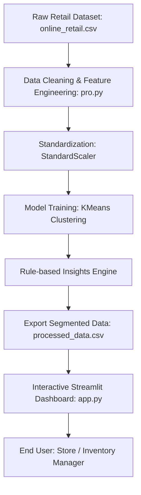

# Hidden Business Loss Detector System

[](https://www.python.org/)
[](https://streamlit.io/)
[](https://scikit-learn.org/)
[](https://pandas.pydata.org/)
[](https://opensource.org/licenses/MIT)

A machine learning and interactive data analytics platform designed to uncover hidden losses (such as high return rates, low-demand stock, and unprofitable items) in retail operations. Powered by unsupervised K-Means clustering and robust rule-based business intelligence, this system converts raw transaction history into actionable inventory and pricing optimizations.

---

## Features

- **Unsupervised K-Means Clustering**: Clusters products into operational states—*Low Demand*, *Stable*, *Hidden Loss*, and *Critical Loss*—based on features like purchase frequency, net revenue, and return rate.
- **Elbow Method Optimization**: Employs mathematical inertia analysis to determine the optimal number of clusters for retail customer and product segmentation.
- **Return & Revenue Aggregation Pipeline**: Extracts, cleans, and aggregates transactional records to isolate sales revenue, calculate negative returns, and evaluate actual return rate percentages.
- **Dynamic Business Rule Insights**: Identifies operational anomalies and flags products as *Loss Making*, *High Return Risk*, *Low Performance*, or *Profitable*.
- **Interactive Streamlit Dashboard**: Provides responsive visualization components including Category filtering, High Risk product reporting, Revenue vs. Return Rate scatter charts, and cluster summary statistics.
- **Production-Ready & Highly Extensible**: Structured with clean separation between the data engineering/ML pipeline and the presentation interface.

## Demo

- **Live Demo Link**: [Launch Application on Streamlit Community Cloud](https://streamlit.io/) *(Placeholder)*
- **Video Demo Link**: [Watch Project Walkthrough on YouTube](https://youtube.com/) *(Placeholder)*

## Screenshots

*Here are some visual insights and previews of the application interface and analysis flow:*

| Streamlit Dashboard Overview | Revenue vs Return Rate Scatter Plot |
| :---: | :---: |
|  |  |

| Elbow Method Optimization Curve | Product Clusters Visualization |
| :---: | :---: |
|  |  |

## Tech Stack

| Component | Technology | Purpose |
| :--- | :--- | :--- |
| **Language** | Python 3.9+ | Main programming language for data engineering, model development, and backend |
| **Framework** | Streamlit | Web framework for rapid deployment of interactive data dashboards |
| **Data Manipulation** | Pandas | Loading, cleaning, merging, and aggregating transaction-level records |
| **Machine Learning** | Scikit-Learn | Standard feature scaling (`StandardScaler`) and clustering (`KMeans`) |
| **Visualization** | Matplotlib | Generating static Elbow Method and cluster scatter plots |
| **Version Control** | Git | Source code control and repository management |

## Project Architecture



The system follows a modern data-to-dashboard workflow:
1. **Ingestion & Prep**: `pro.py` reads raw retail logs (`online_retail.csv`), drops invalid customer IDs, handles missing values, and parses dates.
2. **Aggregations**: The pipeline groups transactions by `StockCode` to calculate total revenue, purchase frequency, unique customers, and return quantities.
3. **Clustering**: Features are scaled and fed into a $K$-Means clustering algorithm ($k=4$) to partition items into four major categories based on demand patterns.
4. **Insights Engine**: Evaluates financial thresholds to flag items with high return risk or loss-making behavior.
5. **Interactive Visualization**: The Streamlit frontend (`app.py`) loads the preprocessed data, displaying charts and filterable lists for inventory managers.

## Folder Structure

```text
Hidden_Business_Loss_Detector_System_ML/
├── .git/                      # Git repository metadata
├── app.py                     # Streamlit dashboard and UI code
├── pro.py                     # ML pipeline (Data cleaning, K-Means clustering, and modeling)
├── processed_data.csv         # Segmented and labeled product dataset used by the dashboard
├── online_retail.csv          # Raw online retail transaction dataset
└── README.md                  # Project documentation (this file)
```

## Installation

Clone the repository and install the dependencies:

```bash
git clone <repository-url>
cd <project-folder>
pip install -r requirements.txt
```

### Running the Application

1. Run the data processing and machine learning pipeline to prepare the dataset:
   ```bash
   python pro.py
   ```

2. Run the Streamlit web dashboard:
   ```bash
   streamlit run app.py
   ```
